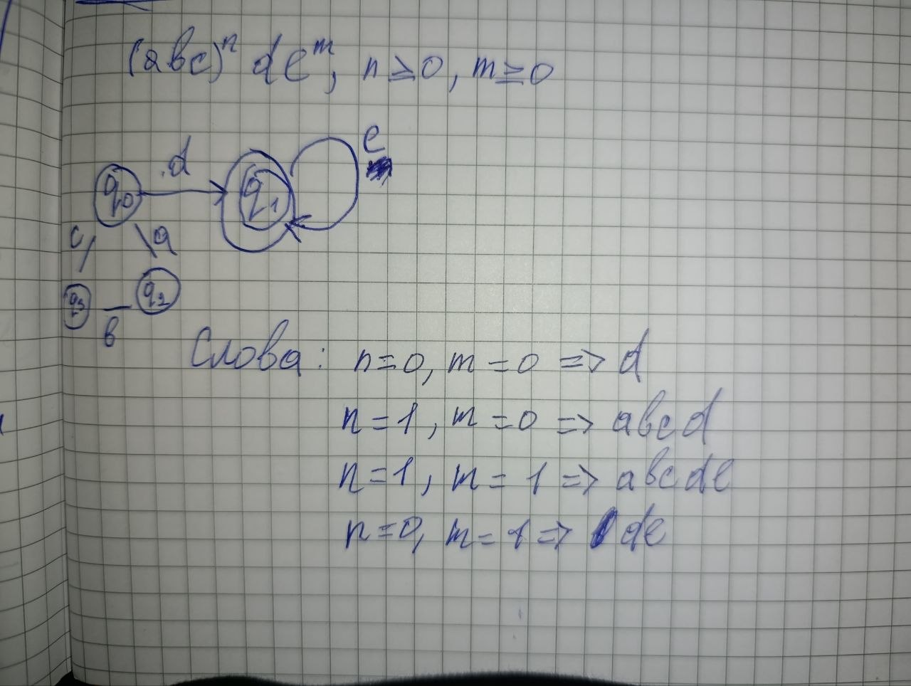
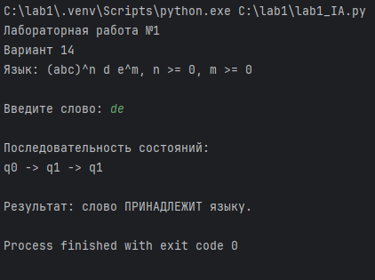

#Лабораторная работа №1

##Тема: Реализация конечного автомата для распознавания формальных языков

##Цель работы

Разработать детерминированный конечный автомат и программу для определения принадлежности слова заданному формальному языку.

##Постановка задачи

Для варианта 14 задан язык:

`(abc)ⁿdeᵐ`, n ≥ 0, m ≥ 0

Необходимо построить конечный автомат и реализовать его на языке `Python`.

##Конечный автомат

Автомат содержит четыре состояния:

q0 — начальное состояние;
q1 — конечное состояние;
q2, q3 — промежуточные состояния.

Переходы:

q0 --a--> q2
q2 --b--> q3
q3 --c--> q0

q0 --d--> q1
q1 --e--> q1

Конечное состояние: `q1`.

##Схема:

##Примеры

###Принадлежат языку:

-`d`
-`de`
-`dee`
-`abcd`
-`abcde`
-`abcabcdeee`

###Не принадлежат:

-`abc`
-`ab`
-`abd`
-`abcdeabc`
-`abcdd`
Например, для слова `abcde`:

q0 → q2 → q3 → q0 → q1 → q1

Конечное состояние `q1`, поэтому слово принимается.

##Программная реализация

def finite_automaton(word):
    state = "q0"

    # Таблица переходов
    transitions = {
        "q0": {
            "a": "q2",
            "d": "q1"
        },

        "q1": {
            "e": "q1"
        },

        "q2": {
            "b": "q3"
        },

        "q3": {
            "c": "q0"
        }
    }

    final_state = "q1"

    print("\nПоследовательность состояний:")
    print(state, end="")

    for symbol in word:

        if symbol in transitions.get(state, {}):
            state = transitions[state][symbol]
        else:
            print(" -> нет перехода", end="")
            return False

        print(" -> " + state, end="")

    print()

    return state == final_state

def main():
    print("Лабораторная работа №1")
    print("Вариант 14")
    print("Язык: (abc)^n d e^m, n >= 0, m >= 0")

    word = input("\nВведите слово: ")

    if finite_automaton(word):
        print("\nРезультат: слово ПРИНАДЛЕЖИТ языку.")
    else:
        print("\nРезультат: слово НЕ ПРИНАДЛЕЖИТ языку.")

main()

##Результат

##Вывод
В ходе лабораторной работы был разработан конечный автомат для языка (abc)^n d e^m и реализована его программная модель на языке Python. Программа последовательно обрабатывает символы входного слова и определяет его принадлежность заданному формальному языку.
